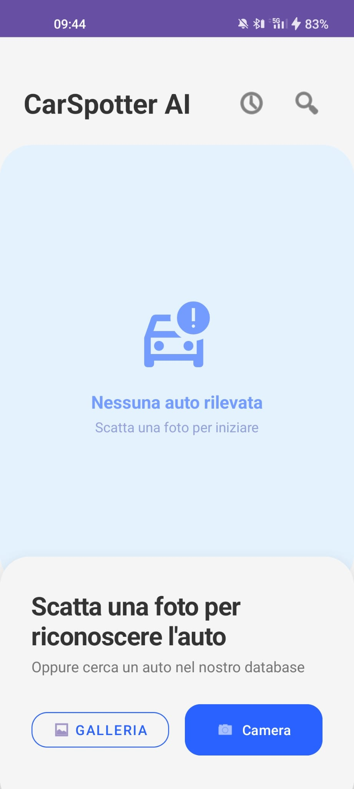
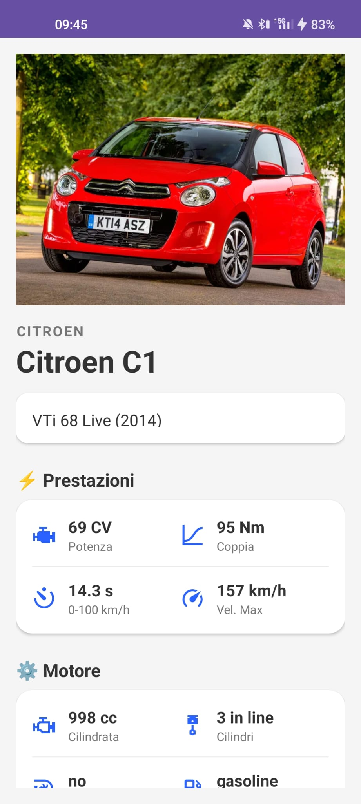
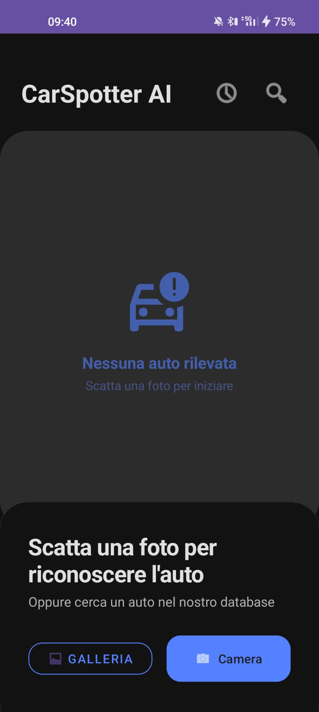
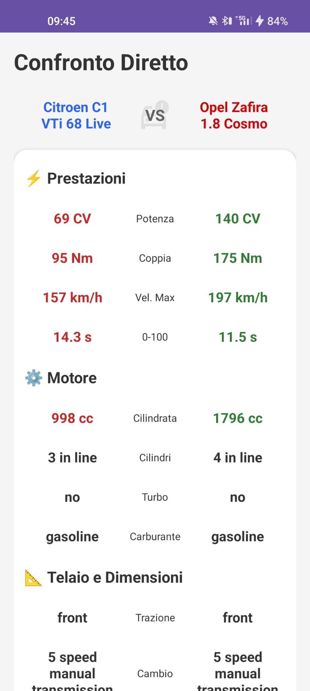

# 🚗 CarSpotter AI

**CarSpotter AI** è un'applicazione Android nativa che utilizza il Deep Learning on-device per identificare veicoli tramite la fotocamera e fornire istantaneamente schede tecniche dettagliate, confronti diretti e funzionalità di storicizzazione.

> 🎓 **Progetto per il corso di Programmazione Mobile** - Laurea Magistrale in Informatica.

---

## ✨ Funzionalità Principali

* 🔍 **Riconoscimento AI Real-Time:** Identificazione del modello dell'auto tramite rete neurale **EfficientNetB0** (TensorFlow Lite) eseguita direttamente sul dispositivo (Edge Computing).
* 📊 **Schede Tecniche Dettagliate:** Visualizzazione di specifiche complete (Cavalli, Coppia, Dimensioni, Prestazioni) recuperate da un database locale ottimizzato.
* ⚔️ **Confronto Intelligente:** Modalità "Versus" per confrontare due veicoli con evidenziazione cromatica dinamica (Verde/Rosso) basata sulla logica "Better-is-Higher" o "Better-is-Lower".
* 📂 **Il Mio Garage:** Sistema di persistenza locale che permette all'utente di salvare le auto scansionate, memorizzando la foto originale scattata e la data di avvistamento.
* 🌙 **Supporto Dark Mode:** Interfaccia utente moderna (Material Design) con gestione semantica dei colori per una perfetta visibilità sia di giorno che di notte.

---

## 🛠️ Tech Stack

### 📱 Android App (Kotlin)
* **Architettura:** MVC con gestione asincrona tramite **Kotlin Coroutines** e `LifecycleScope`.
* **Database:** **Room** (SQLite abstraction) per la gestione efficiente di grandi moli di dati strutturati.
* **AI Engine:** **TensorFlow Lite** per l'inferenza del modello on-device.
* **UI:** XML Layouts, CardView, RecyclerView, ConstraintLayout.
* **Storage:** Gestione ibrida (Database per i metadati, Internal Storage per le immagini utente).

### 🧠 Data Science & AI (Python)
* **Preprocessing Pipeline:** Script Python (`pandas`) per ETL (Extract, Transform, Load) dei dati grezzi.
* **Model Training:** **TensorFlow/Keras** con tecnica di Transfer Learning su EfficientNetB0.
* **Analisi Dati:** EDA (Exploratory Data Analysis) per studio distribuzione classi e pulizia dataset.

---

## 📂 Struttura del Repository

Il progetto è diviso in due moduli logici:

```text
Progetto_CarSpotter/
├── AndroidApp/          # Codice sorgente dell'Applicazione Android
│   ├── app/src/main/    # Activity, XML, Logica Kotlin
│   └── ...
│
├── DataScience/         # Pipeline di Preprocessing e Training AI
│   ├── cars_final.csv   # Dataset pulito e pronto per l'importazione
│   ├── first_analysis.py   # Analisi iniziale
│   ├── img_downloader.py   # Auto-Downloader delle immagini per la scheda auto
│   ├── eda.py           # Script di Analisi Esplorativa (EDA)
│   ├── cleaner.py       # Pipeline di pulizia e normalizzazione dati
│   └── Car_Recognition_Model.ipynb  # Notebook di training del modello
│
└── README.md            # Documentazione
```
## ⚙️ Data Pipeline & AI

Il cuore intelligente dell'app non si basa su dati grezzi, ma su una pipeline ingegnerizzata:

1. **Analisi** (*first_analysis.py* e *eda.py*): Filtraggio attributi e marchi, studio preliminare della cardinalità degli attributi (carburante, trasmissione) e identificazione anomalie.

2. **Cleaning** (*cleaner.py*):

   * Rimozione unità di misura testuali (es. "150 HP" -> *150.0*).
   * Gestione valori nulli o errati.
   * Estrazione marchio, nome modello e trim dal nome completo.
   * *Risultato*: Un CSV ottimizzato che riduce il tempo di parsing lato Android.

3. **Training** (*Car_Recognition_Model.ipynb*):

    * Modello base: **EfficientNetB0** (pre-addestrato su ImageNet).
    * Strategia: **Feature Extraction** (per massimizzare la generalizzazione su dataset ridotti ed evitare overfitting da fine-tuning aggressivo).
    * Ottimizzazione: Quantizzazione del modello *.tflite* per ridurre latenza e dimensione.

## 🚀 Installazione e Setup
### Prerequisiti
* Android Studio
* Dispositivo fisico Android (Consigliato per testare la fotocamera) o Emulatore con camera virtuale.

### Istruzioni
1. Scaricare i dati da questa cartella drive: [PM_Project](https://drive.google.com/drive/folders/1BPkDebmRsbw67XzLymogdLD5ziEt0lkH?usp=sharing). Nella cartella è presente il dataset utilizzato per il training (*dataset_auto*) e le immagini delle auto per la scheda auto (*drawable*). Il contenuto di quest'ultima dev'essere incollato in *CarSpotter\app\src\main\res\drawable*. In essa sono inoltre presenti i grafici relativi all'EDA.
2. Clonare il repository:
    ```bash
    git clone [https://github.com/gammic/CarSpotter_AI.git](https://github.com/gammic/CarSpotter_AI.git)
    ```
3. Aprire Android Studio.

4. Selezionare Open e navigare nella cartella *AndroidApp*.

5. Attendere il completamento del Gradle Sync.

6. Collegare il dispositivo via USB (assicurarsi di aver attivato il Debug USB).

7. Cliccare su Run (▶️).


**Nota sui Permessi**: Al primo avvio, l'app richiederà il permesso per l'uso della fotocamera. È necessario concederlo per utilizzare le funzionalità di riconoscimento.

## 📸 Screenshots
, ,,

## 👤 Autore
Michellini Marco

Matricola: 207429

Corso: Programmazione Mobile - Informatica Magistrale

Università: UniMoRe
